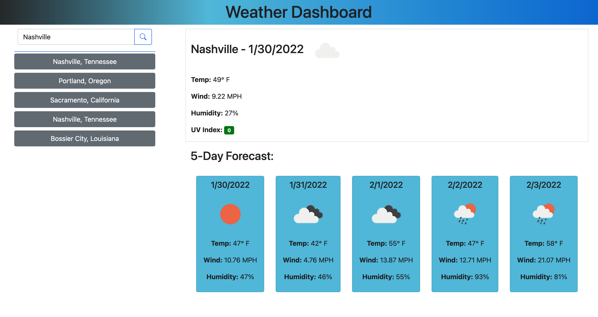

# weather-dashboard

## Purpose
A dashboard and search engine using OpenWeather's One Call api to search for weather in a specific city, displaying information for today and the next 5 days after that.  The application saves your searches for easy access.

## Built With
* HTML
* CSS
* JavaScript
* OpenWeather's One Call

## Deployed Application
https://drewspeed.github.io/weather-dashboard/ 

## Screenshot

### Made by Drew Speed
